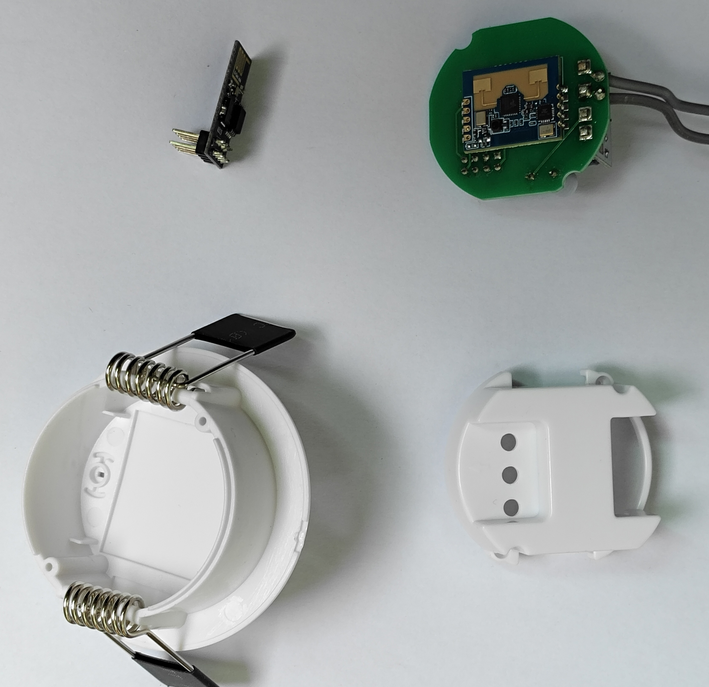

# DIY Radar Human Motion Sensor Module

A DIY radar-based human motion sensor module compatible with **Home Assistant** and **ESPHome**.  
Equipped with **Bluetooth APP tuning** and a **protective enclosure**, making it suitable for real smart home deployment.

        
---

## ✨ Features
- ✅ **Home Assistant & ESPHome compatible**
- ✅ **Radar-based motion detection** (micro-movement support, more accurate than PIR)
- ✅ **Bluetooth APP tuning** (configure sensitivity, range, and delay via smartphone)
- ✅ **Pluggable ESP-01 module**  
  - Easy to remove for firmware flashing  
  - Supports OTA firmware upgrade  
- ✅ **Wide voltage input: AC 85V ~ 240V**
- ✅ **Protective enclosure included** (safe, easy to install, neat appearance)
---

## 📱 Bluetooth APP Tuning
- Use the **mobile APP** to configure the radar module:
  - Sensitivity level
  - Detection distance (near/far)
  - Trigger delay time
  - Anti-interference settings  
- Parameters are stored in the radar module, no need to reflash firmware.

    


---

## 🛠 Hardware
- **Radar module** with Bluetooth APP configuration support
- **ESP-01 WiFi module** (GPIO2 control)
- Power supply: AC 85V ~ 240V
- **Protective enclosure** for safe installation
---

## 📦 Installation
1. Flash ESPHome firmware to ESP-01.
2. Connect the radar module to ESP-01 (GPIO2).
3. Pair the radar with the mobile APP via Bluetooth and adjust parameters.
4. Add the device to **Home Assistant** via ESPHome.

---

## 🔧 ESPHome Example Config
```yaml

esphome:
  name: radar_sensor

esp8266:
  board: esp01_1m

logger:

api:
  encryption:
    key: "12345678"

ota:
  - platform: esphome
    password: "12345678"

wifi:
  ssid: "YOUR_WIFI"
  password: "YOUR_PASSWORD"

binary_sensor:
  - platform: gpio
    pin: GPIO2
    name: "Radar Motion Sensor"
    device_class: motion
    filters:
      delayed_off: 5s
