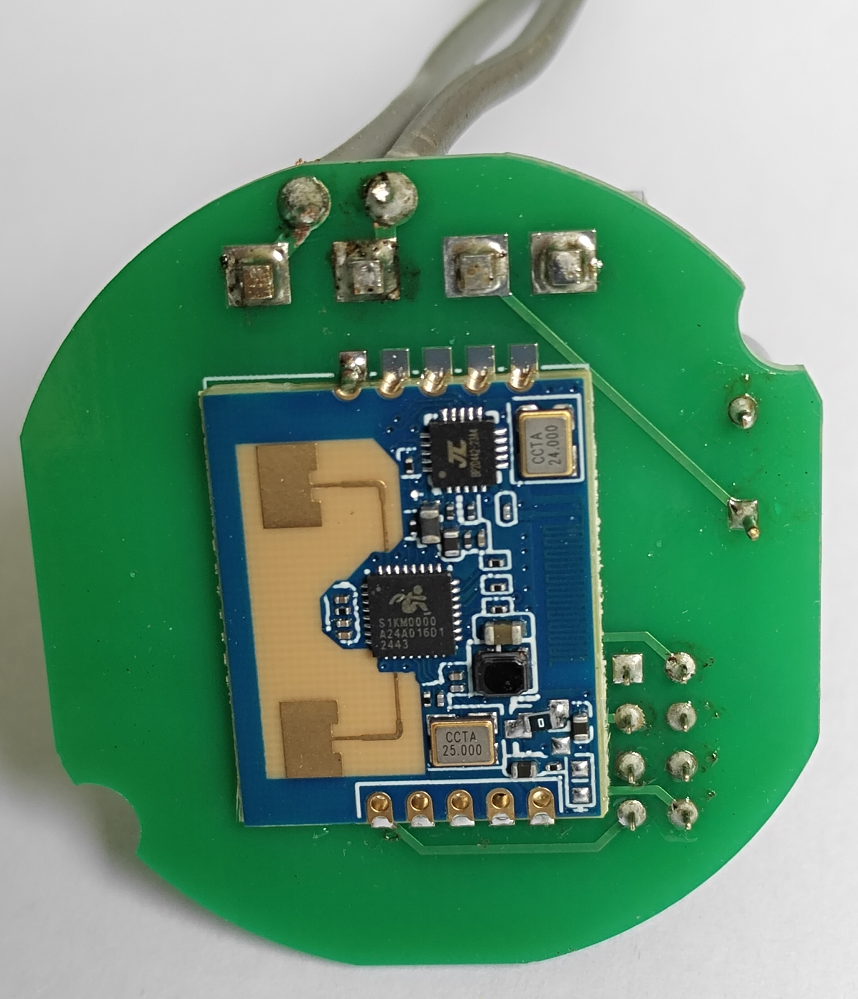
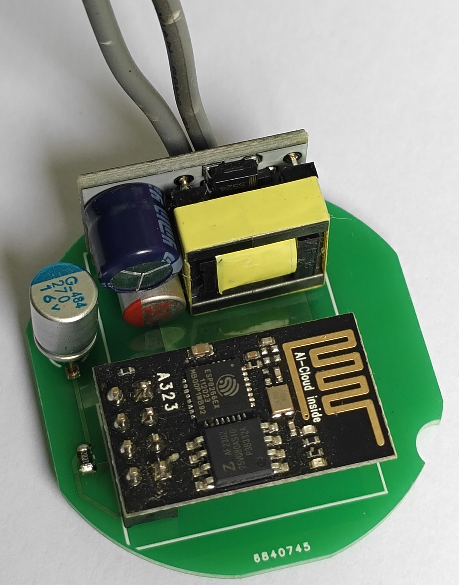
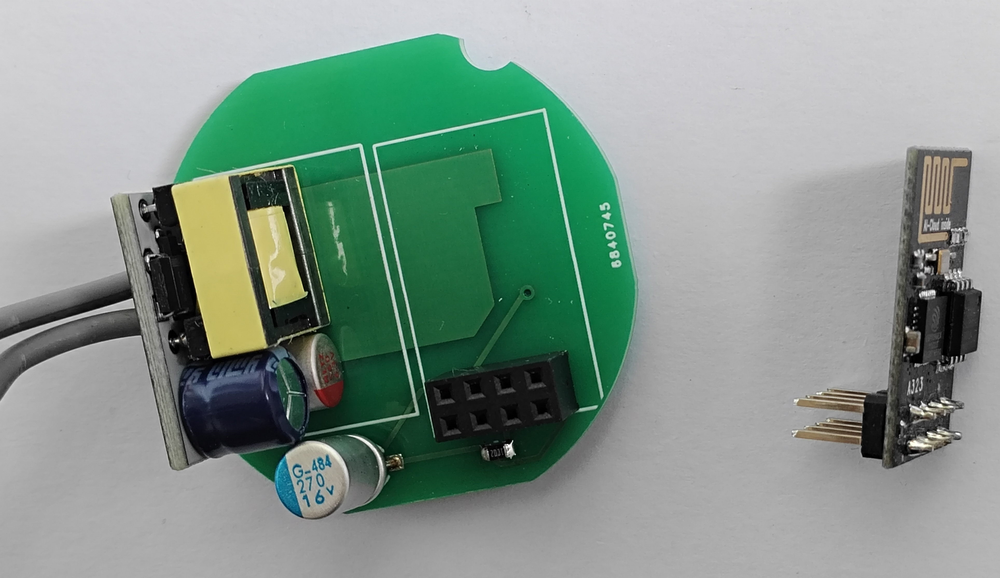
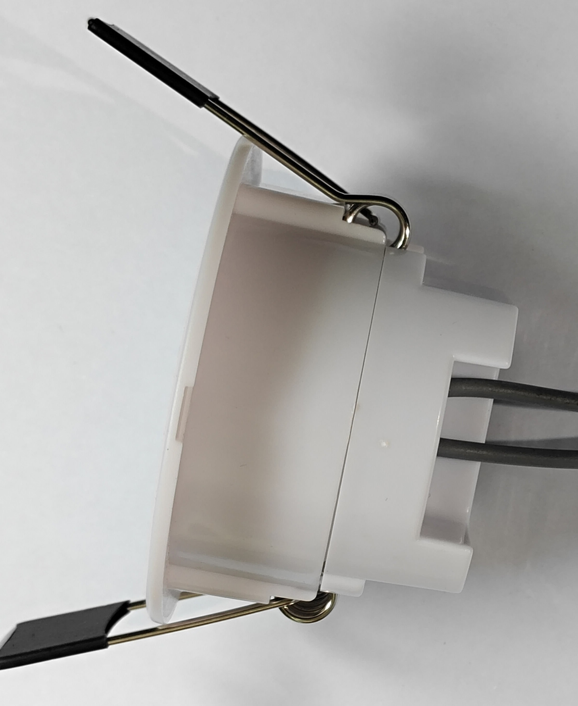
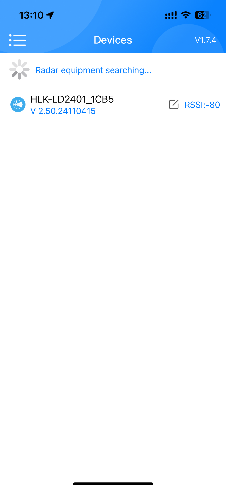
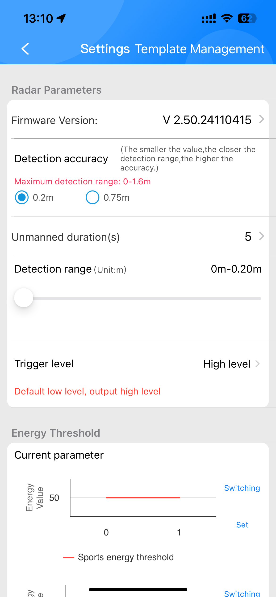
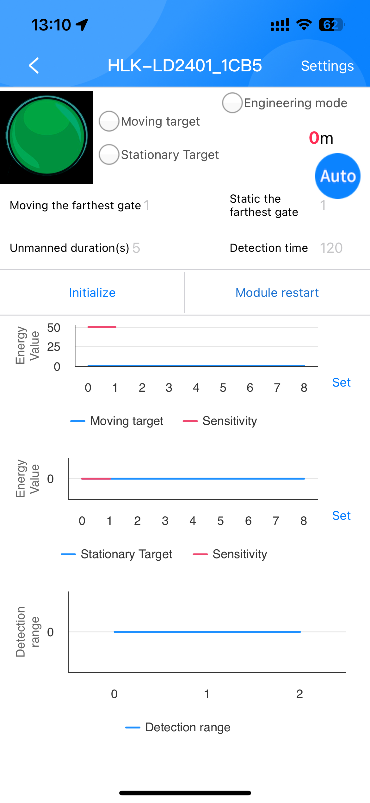

# DIY Radar Human Motion Sensor Module

A DIY radar-based human motion sensor compatible with **Home Assistant** and **ESPHome**.  
This module integrates **Bluetooth APP configuration**, making it easy to adjust parameters such as sensitivity, detection distance, and delay directly from your smartphone.

        
---

## ✨ Features
- ✅ **Home Assistant & ESPHome compatible**
- ✅ **Radar-based motion detection** (more accurate than PIR, supports micro-movement detection)
- ✅ **Bluetooth APP tuning** (adjust parameters via smartphone app)
- ✅ **ESP-01 module (GPIO2)** with OTA firmware upgrade support
- ✅ **Wide voltage input: AC 85V ~ 240V**, plug-and-play

---

## 📱 Bluetooth APP Tuning
- Use the **mobile APP** to configure the radar module:
  - Sensitivity level
  - Detection distance (near/far)
  - Trigger delay time
  - Anti-interference settings  
- Parameters are stored in the radar module, no need to reflash firmware.

    


---

## 🛠 Hardware
- **Radar module** with Bluetooth APP configuration support
- **ESP-01 WiFi module** (GPIO2 control)
- Power supply: AC 85V ~ 240V

---

## 📦 Installation
1. Flash ESPHome firmware to ESP-01.
2. Connect the radar module to ESP-01 (GPIO2).
3. Pair the radar with the mobile APP via Bluetooth and adjust parameters.
4. Add the device to **Home Assistant** via ESPHome.

---

## 🔧 ESPHome Example Config
```yaml

esphome:
  name: radar_sensor

esp8266:
  board: esp01_1m

logger:

api:
  encryption:
    key: "12345678"

ota:
  - platform: esphome
    password: "12345678"

wifi:
  ssid: "YOUR_WIFI"
  password: "YOUR_PASSWORD"

binary_sensor:
  - platform: gpio
    pin: GPIO2
    name: "Radar Motion Sensor"
    device_class: motion
    filters:
      delayed_off: 5s
